# Total Compensation Calculator - Architecture Documentation

**Version:** 3.0  
**Date:** July 2025 (Updated with Performance Optimization System)  
**Audience:** Junior Software Engineers

---

## Table of Contents

1. [Overview](#overview)
2. [High-Level Architecture](#high-level-architecture)
3. [Performance Optimization System](#performance-optimization-system)
4. [Client-Side Architecture](#client-side-architecture)
5. [Data Flow & Sync](#data-flow--sync)
6. [Security Architecture](#security-architecture)
7. [Deployment Architecture](#deployment-architecture)
8. [Technology Stack Deep Dive](#technology-stack-deep-dive)
9. [Key Concepts for Junior Engineers](#key-concepts-for-junior-engineers)

---

## Overview

The Total Compensation Calculator is a **local-first, privacy-focused web application** that helps users track their complete compensation packages (salary, bonuses, equity). The architecture prioritizes:

- **Privacy**: All sensitive data is encrypted client-side
- **Performance**: Instant page loads with three-tier optimization system
- **Offline Support**: Works without internet connection
- **Real-time Sync**: Changes sync across devices automatically

### What makes this architecture special?

1. **Zero-Knowledge**: The server never sees your unencrypted data
2. **Local-First**: Your data lives on your device first, server second
3. **Performance-First**: Three-tier optimization for instant loading
4. **Progressive Web App (PWA)**: Installs like a native app
5. **Edge Computing**: Fast global response times

---

## High-Level Architecture


### How it works (Simple Explanation):

1. **Your Browser** is where you interact with the app
2. **IndexedDB** stores your data locally (like a mini-database on your device)
3. **Service Worker** handles offline functionality and background sync
4. **WASM** provides fast, secure encryption
5. **Edge Functions** are servers close to you for fast responses
6. **Convex** is the main database in the cloud
7. **WorkOS** handles secure login
8. **PostHog** tracks app usage (anonymously)

---

## Performance Optimization System

The application implements a comprehensive **three-tier performance optimization system** that delivers instant page loads and sub-50ms response times:


### Performance Optimization Phases

#### **Phase 1: Key Derivation Cache** 🚀
- **Purpose**: Eliminate expensive Argon2 key derivation repeats
- **Implementation**: `KeyDerivationCache` with 15-minute TTL
- **Performance Gain**: 80-90% faster on repeated operations
- **Location**: `src/lib/crypto/keyCache.ts`

```typescript
// Cached key derivation
const key = await keyCache.getOrDeriveKey(password, salt);
// vs. uncached: 500-1000ms → cached: <50ms
```

#### **Phase 2: Summary-First Loading** ⚡
- **Purpose**: Load minimal data for dashboard display
- **Implementation**: `useCompensationSummaries` + `useCompensationDetails`
- **Performance Gain**: 75-90% faster dashboard loading
- **Location**: `src/hooks/useCompensationSummaries.ts`

```typescript
// Summary loading (essential fields only)
const { summaries } = useCompensationSummaries(); // Fast
// vs. full loading: 2-5s → summary: <100ms
```

#### **Phase 3: Session Data Cache** ⚡⚡
- **Purpose**: Instant page navigation within session
- **Implementation**: `SessionDataCache` with smart invalidation
- **Performance Gain**: 0ms page loads (instant)
- **Location**: `src/services/sessionDataCache.ts`

```typescript
// Session cache check
const cachedData = sessionDataCache.getSummaries(userId);
// Result: Instant loading on repeat visits
```

### Performance Results

| Operation | Before Optimization | After Optimization | Improvement |
|-----------|-------------------|-------------------|-------------|
| **Dashboard Load** | 2-5 seconds | <100ms (instant) | **95%+ faster** |
| **Key Derivation** | 500-1000ms | <50ms | **90%+ faster** |
| **Page Navigation** | 1-3 seconds | 0ms | **Instant** |
| **Data Decryption** | Full records | Summary only | **70%+ less data** |

### Smart Cache Management

#### **Change Detection**
```typescript
// Automatic invalidation when data changes
sessionDataCache.setSummaries(userId, newSummaries);
// Generates data version hash for change detection
```

#### **Memory Management**
- Maximum 5 cache entries per session
- Automatic cleanup every 5 minutes
- TTL-based expiration (10 minutes for session, 15 for keys)
- Memory usage estimation and reporting

#### **Cross-Tab Synchronization**
- Window focus detection triggers cache refresh
- Background sync invalidates stale cache
- Prevents inconsistent data across tabs

### Three-Tier Loading Strategy


### Performance Monitoring

The system includes comprehensive performance monitoring:

```typescript
// Cache statistics
const stats = sessionDataCache.getStats();
console.log({
  hitRate: `${stats.hitRate}%`,
  memoryUsage: stats.memoryUsageEstimate,
  cacheSize: stats.cacheSize
});
```

---

## Client-Side Architecture


### Layer Explanations:

#### 1. **React Application Layer**
- **Next.js Pages**: The different screens (Dashboard, Settings, etc.)
- **UI Components**: Reusable pieces (buttons, forms, charts)
- **Custom Hooks**: Reusable logic for components

#### 2. **State Management**
- **Zustand Store**: Manages app-wide state (like current user, settings)
- **Convex Hooks**: Connect to real-time database
- **Component State**: Local state for individual components

#### 3. **Services Layer**
- **Sync Service**: Handles syncing data between local and cloud
- **Crypto Service**: Encrypts/decrypts sensitive data with corruption detection
- **Storage Service**: Manages local data storage with automatic timeline management
- **Validation Service**: Enforces business rules and data integrity constraints
- **Offline Service**: Handles offline functionality and background sync
- **Session Cache Service**: Manages session-level data caching

#### 4. **Performance Layer** ⚡ NEW
- **Key Derivation Cache**: Caches expensive Argon2 key derivations (15-min TTL)
- **Session Data Cache**: In-memory caching for instant page navigation
- **Summary Hooks**: Optimized hooks for minimal data loading
- **Detail Hooks**: Lazy loading hooks for full record details

#### 5. **Data Layer**
- **IndexedDB**: Browser database for local storage
- **Memory Cache**: Fast temporary storage (enhanced with session cache)
- **Service Worker Cache**: Caches app files for offline use

---

## Data Flow & Sync


### Sync Process Explained:

1. **User Action**: User adds/edits compensation data
2. **Smart Validation**: Check for existing current salaries and business rules
3. **Automatic Timeline Management**: Update previous salary end dates automatically
4. **Immediate UI Update**: App shows changes instantly (optimistic update)
5. **Local Storage**: Data saved to IndexedDB immediately with encryption
6. **Background Sync**: Data encrypted and sent to cloud
7. **Conflict Resolution**: If conflicts occur, last-write-wins with version tracking

### Enhanced Features:

- **Salary Timeline Integrity**: Automatically manages salary start/end dates
- **Corruption Detection**: Identifies and cleans up corrupted encrypted records
- **Smart Validation**: Prevents data inconsistencies before they occur
- **Audit Trail**: Complete history of all changes with versioning
- **Performance Optimization**: Three-tier caching for instant operations
- **Session Data Cache**: Maintains data across page navigation
- **Key Caching**: Eliminates expensive key re-derivation

### Why this approach?

- **Instant Response**: Users see changes immediately with cached keys
- **Reliable**: Data saved locally first, so nothing is lost
- **Offline Support**: Works even without internet
- **Multi-device**: Changes sync across all your devices
- **Data Integrity**: Automatic timeline management prevents gaps/overlaps
- **Performance**: 80-90% faster operations with comprehensive caching

---

## Security Architecture


### Security Layers Explained:

#### 1. **Client-Side Encryption (Zero-Knowledge)**
```typescript
// Simplified example of how encryption works
const password = "user-password";
const salt = generateSalt();

// Derive encryption key from password using Argon2
const key = await argon2.derive(password, salt);

// Encrypt sensitive data
const encryptedData = await aes256gcm.encrypt(sensitiveData, key);

// Only encrypted data is sent to server
sendToServer(encryptedData); // Server can't decrypt this!
```

#### 2. **Transport Security**
- **TLS 1.3**: All data encrypted in transit
- **Content Security Policy**: Prevents XSS attacks
- **CORS**: Controls which domains can access our API

#### 3. **Authentication**
- **WorkOS SSO**: Enterprise-grade login (Google, Microsoft, etc.)
- **JWT Tokens**: Secure session tokens
- **Session Management**: Automatic timeout for security

#### 4. **Server-Side Security**
- **Rate Limiting**: Prevents abuse (100 requests/minute per user)
- **Audit Logging**: Tracks all access for compliance
- **Zero-Knowledge Storage**: Server never sees unencrypted data

---

## Deployment Architecture


### Deployment Process:

1. **Developer pushes code** to GitHub
2. **GitHub Actions** automatically run tests and build
3. **Vercel** deploys to global edge network
4. **Edge Functions** serve API requests close to users
5. **CDN** serves static files (HTML, CSS, JS) globally
6. **External Services** provide specialized functionality

### Why Edge Deployment?

- **Fast Loading**: Files served from nearest location
- **Low Latency**: API responses in ~50-100ms globally
- **Scalability**: Automatically handles traffic spikes
- **Reliability**: Multiple servers ensure uptime

---

## Technology Stack Deep Dive

### Frontend Technologies

#### **Next.js 15 (React Framework)**
```typescript
// Example: App Router structure
app/
├── layout.tsx          // Root layout
├── page.tsx           // Home page
├── dashboard/
│   ├── page.tsx       // Dashboard page
│   └── loading.tsx    // Loading component
└── api/
    └── sync/
        └── route.ts   // API endpoint
```

**Why Next.js?**
- **Server-Side Rendering**: Fast initial page loads
- **App Router**: Modern routing with layouts
- **API Routes**: Backend functionality in same codebase
- **Automatic Optimization**: Images, fonts, bundles optimized automatically

#### **Tailwind CSS + Radix UI**
```typescript
// Example: Styled button component
<Button className="bg-blue-500 hover:bg-blue-600 px-4 py-2 rounded-lg">
  Save Compensation
</Button>
```

**Why this combination?**
- **Tailwind**: Utility-first CSS, fast development
- **Radix UI**: Accessible, unstyled components
- **Consistent Design**: Predefined spacing, colors, typography

#### **Zustand (State Management)**
```typescript
// Example: Simple state store
const useCompensationStore = create((set) => ({
  records: [],
  addRecord: (record) => set((state) => ({ 
    records: [...state.records, record] 
  })),
  isLoading: false,
  setLoading: (loading) => set({ isLoading: loading })
}));
```

**Why Zustand over Redux?**
- **Simpler**: Less boilerplate code
- **TypeScript-first**: Great type safety
- **Small bundle**: Only 2.9kb gzipped
- **No providers**: Direct store access

### Backend Technologies

#### **Convex (Real-time Database)**
```typescript
// Example: Database mutation
export const addCompensation = mutation({
  args: {
    userId: v.string(),
    type: v.union(v.literal('salary'), v.literal('bonus')),
    encryptedData: v.object({
      data: v.string(),
      iv: v.string(),
      salt: v.string()
    })
  },
  handler: async (ctx, args) => {
    return await ctx.db.insert('compensationRecords', {
      ...args,
      createdAt: Date.now()
    });
  }
});
```

**Why Convex?**
- **Real-time**: Changes appear instantly across devices
- **TypeScript**: End-to-end type safety
- **Offline Support**: Built-in sync conflict resolution
- **ACID Transactions**: Data consistency guaranteed

#### **WorkOS (Authentication)**
```typescript
// Example: SSO login
const handleLogin = async () => {
  const authUrl = workos.sso.getAuthorizationUrl({
    domain: 'company.com',
    redirectUri: 'https://app.example.com/callback'
  });
  window.location.href = authUrl;
};
```

**Why WorkOS?**
- **Enterprise SSO**: Google, Microsoft, Okta support
- **Audit Logging**: Compliance requirements
- **Admin Portal**: IT teams can manage access
- **Security**: Industry-standard protocols

### Security Technologies

#### **Argon2 WASM (Password Hashing)**
```typescript
// Example: Key derivation
const deriveKey = async (password: string, salt: Uint8Array) => {
  const argon2 = await loadArgon2();
  return argon2.hash({
    password: new TextEncoder().encode(password),
    salt: salt,
    timeCost: 3,        // iterations
    memoryCost: 65536,  // 64MB memory
    hashLength: 32,     // 256-bit key
    type: argon2.Type.Argon2id
  });
};
```

**Why Argon2?**
- **Security**: Winner of password hashing competition
- **Configurable**: Adjust time/memory costs
- **WASM Performance**: Faster than JavaScript implementation
- **Industry Standard**: Used by major security tools

#### **AES-256-GCM (Data Encryption)**
```typescript
// Example: Encrypt sensitive data
const encryptData = async (data: string, key: CryptoKey) => {
  const iv = crypto.getRandomValues(new Uint8Array(12));
  const encodedData = new TextEncoder().encode(data);
  
  const encryptedData = await crypto.subtle.encrypt(
    { name: 'AES-GCM', iv },
    key,
    encodedData
  );
  
  return {
    data: arrayBufferToBase64(encryptedData),
    iv: arrayBufferToBase64(iv)
  };
};
```

**Why AES-256-GCM?**
- **Security**: Military-grade encryption
- **Authentication**: Detects data tampering
- **Performance**: Hardware acceleration available
- **Standard**: Used by banks, governments

---

## Key Concepts for Junior Engineers

### 1. **Local-First Architecture**

**Traditional App (Server-First):**
```
User Action → Server → Database → Server → UI Update
(Slow: 200-500ms)
```

**Our App (Local-First):**
```
User Action → Local Storage → UI Update (Fast: <50ms)
              ↓
         Background Sync → Server
```

**Benefits:**
- **Instant response**: No waiting for server
- **Offline support**: Works without internet
- **Better UX**: No loading spinners for basic actions

### 2. **Zero-Knowledge Architecture**

**Traditional App:**
```
Client: "Save my salary: $100,000"
Server: "OK, I can see you make $100,000" ❌
```

**Our App:**
```
Client: "Save this encrypted blob: xK8#mN2..."
Server: "OK, I saved the blob (but can't read it)" ✅
```

**Benefits:**
- **Privacy**: Server never sees sensitive data
- **Security**: Even if server is hacked, data is safe
- **Compliance**: Easier to meet privacy regulations

### 3. **Progressive Web App (PWA)**

A PWA is a web app that feels like a native app:

- **Installable**: Add to home screen
- **Offline**: Works without internet
- **Fast**: Cached resources load instantly
- **Responsive**: Works on any device size

### 4. **Edge Computing**

Instead of one server in one location:

```
Traditional:
User (Tokyo) → Server (US) → Database (US) → User (Tokyo)
(Slow: 500ms+ round trip)

Edge Computing:
User (Tokyo) → Edge Server (Tokyo) → Database (US) → Edge Server (Tokyo) → User (Tokyo)
(Fast: ~100ms round trip)
```

### 5. **Real-time Sync**

When you change data on one device, it automatically appears on all your other devices:

```mermaid
graph LR
    Phone[📱 Phone] 
    Laptop[💻 Laptop]
    Tablet[📱 Tablet]
    
    Phone <--> Cloud[(☁️ Cloud)]
    Laptop <--> Cloud
    Tablet <--> Cloud
    
    Phone -.->|"Real-time sync"| Laptop
    Phone -.->|"Real-time sync"| Tablet
    Laptop -.->|"Real-time sync"| Tablet
```



### 6. **Optimistic Updates**

Instead of waiting for server confirmation:

**Pessimistic (Traditional):**
1. User clicks "Save"
2. Show loading spinner
3. Send to server
4. Wait for response
5. Update UI

**Optimistic (Our App):**
1. User clicks "Save"
2. Update UI immediately
3. Send to server in background
4. If error, revert and show error

### Common Development Patterns

#### **Custom Hooks Pattern**
```typescript
// Reusable logic for components
const useCompensationData = () => {
  const [data, setData] = useState([]);
  const [loading, setLoading] = useState(true);
  
  useEffect(() => {
    loadCompensationData().then(setData).finally(() => setLoading(false));
  }, []);
  
  return { data, loading };
};

// Use in component
const Dashboard = () => {
  const { data, loading } = useCompensationData();
  
  if (loading) return <LoadingSpinner />;
  return <CompensationChart data={data} />;
};
```

#### **Service Layer Pattern**
```typescript
// Separate business logic from UI
class SyncService {
  static async saveCompensation(data: CompensationData) {
    // 1. Validate business rules
    const validation = await ValidationService.validate(data);
    if (!validation.isValid) throw new Error(validation.message);
    
    // 2. Handle automatic timeline management
    if (data.type === 'salary' && data.isCurrentPosition && validation.previousCurrentSalaryId) {
      await StorageService.updatePreviousSalaryEndDate(
        validation.previousCurrentSalaryId,
        calculateEndDate(data.startDate)
      );
    }
    
    // 3. Encrypt data
    const encrypted = await CryptoService.encrypt(data);
    
    // 4. Save locally
    await StorageService.save(encrypted);
    
    // 5. Sync to cloud
    await this.syncToCloud(encrypted);
  }
}

// Use from component
const handleSave = async (data) => {
  await SyncService.saveCompensation(data);
};
```

#### **Error Boundary Pattern**
```typescript
// Catch and handle errors gracefully
const ErrorBoundary = ({ children }) => {
  const [hasError, setHasError] = useState(false);
  
  if (hasError) {
    return <ErrorFallback onRetry={() => setHasError(false)} />;
  }
  
  return children;
};
```

### 7. **Performance Optimization Patterns** ⚡ NEW

#### **Three-Tier Cache Architecture**
```typescript
// Tier 1: Session Cache (0ms)
const cachedData = sessionDataCache.getSummaries(userId);
if (cachedData) return cachedData; // Instant

// Tier 2: Summary Loading (<100ms)
const { summaries } = useCompensationSummaries(); // Minimal data

// Tier 3: Lazy Detail Loading (on-demand)
const fullRecord = await loadRecordDetails(recordId); // Complete data
```

#### **Smart Key Caching**
```typescript
// Instead of expensive key derivation every time
const key = await keyCache.getOrDeriveKey(password, salt);
// Result: 500-1000ms → <50ms (80-90% improvement)
```

#### **Summary-First Loading Pattern**
```typescript
// Load minimal data for dashboard
interface SalarySummary {
  id: number;
  company: string;
  title: string;
  amount: number;
  currency: string;
  // Only essential fields, not full record
}

// vs. full record with all metadata, notes, etc.
```

#### **Session Cache Invalidation**
```typescript
// Automatic cache invalidation when data changes
const handleDataChange = async (newData) => {
  await saveData(newData);
  sessionDataCache.invalidateUser(userId); // Ensure fresh data
};
```

### 8. **Advanced Features & Patterns**

#### **Automatic Salary Timeline Management**
```typescript
// When creating a new current salary, automatically end the previous one
const handleNewCurrentSalary = async (newSalaryData) => {
  // 1. Find existing current salary
  const validation = await validateCurrentSalaryConstraint(
    userId, 
    true, // isCurrentPosition
    password
  );
  
  // 2. If found, automatically set its end date
  if (validation.previousCurrentSalaryId) {
    const endDate = calculateEndDate(newSalaryData.startDate); // One day before
    await LocalStorageService.updatePreviousSalaryEndDate(
      validation.previousCurrentSalaryId,
      endDate,
      password
    );
  }
  
  // 3. Save new salary
  await saveNewSalary(newSalaryData);
};
```

#### **Corruption Detection & Recovery**
```typescript
// Automatic cleanup of corrupted encrypted records
const auditAndCleanupCorruptedRecords = async (
  records: EncryptedRecord[],
  password: string
) => {
  const failedRecords = [];
  
  for (const record of records) {
    try {
      await EncryptionService.decryptData(record.encryptedData, password);
    } catch (error) {
      console.error(`Corrupted record detected: ${record.id}`);
      failedRecords.push(record);
    }
  }
  
  // Safety limit: only clean up 2 records per session
  if (failedRecords.length > 0 && failedRecords.length <= 2) {
    for (const record of failedRecords) {
      await LocalStorageService.deleteCompensationRecord(record.id!);
    }
  }
};
```

#### **Smart Validation with Business Rules**
```typescript
// Enforce business constraints before data persistence
export async function validateCurrentSalaryConstraint(
  userId: string,
  isCurrentPosition: boolean,
  password: string,
  editingRecordId?: number
): Promise<{
  isValid: boolean;
  message?: string;
  previousCurrentSalaryId?: number;
  previousCurrentSalaryData?: DecryptedSalaryData;
}> {
  // Only one current salary allowed
  // Returns previous current salary info for automatic timeline management
  // Handles encryption/decryption errors gracefully
}
```

---

This architecture documentation provides a comprehensive overview of how the Total Compensation Calculator is built. The key takeaway is that we've prioritized user experience, privacy, and performance through careful architectural decisions like local-first data, zero-knowledge encryption, and edge computing.

For junior engineers, focus on understanding these core concepts:
1. **Component-based architecture** (React)
2. **Local-first data flow** (immediate UI updates)
3. **Performance optimization** (three-tier caching system)
4. **Service layers** (separation of concerns)
5. **Security by design** (encryption first)
6. **Progressive enhancement** (works offline)
7. **Business rule validation** (data integrity)
8. **Automatic error recovery** (corruption handling)
9. **Timeline management** (automatic relationship handling)
10. **Smart caching strategies** (key derivation, session data, lazy loading)

Each of these patterns and technologies serves a specific purpose in creating a fast, secure, and reliable application. The performance optimization system demonstrates how thoughtful caching architecture can deliver instant user experiences while maintaining security and data integrity. The advanced features like automatic timeline management and corruption recovery show how careful design prevents user frustration and data inconsistencies.

### Performance Architecture Highlights:

- **Three-tier optimization**: Session Cache → Summary Loading → Key Caching
- **Smart invalidation**: Automatic cache updates when data changes
- **Memory management**: Controlled cache sizes with TTL expiration
- **Cross-tab sync**: Consistent data across browser tabs
- **Lazy loading**: Full details loaded only when needed
- **Change detection**: Prevents stale data with version hashing

This comprehensive performance system enables the application to provide instant user experiences (0ms page loads) while maintaining the zero-knowledge security model and local-first architecture principles.

---

**Document Version History**

- v1.0 - Initial architecture documentation (July 2025)
- v2.0 - Enhanced with detailed security and deployment architecture (July 2025)
- v3.0 - **Major update**: Added comprehensive Performance Optimization System with three-tier caching architecture, session data cache, key derivation cache, and summary-first loading patterns. Updated all diagrams and code examples to reflect current implementation. (July 2025)