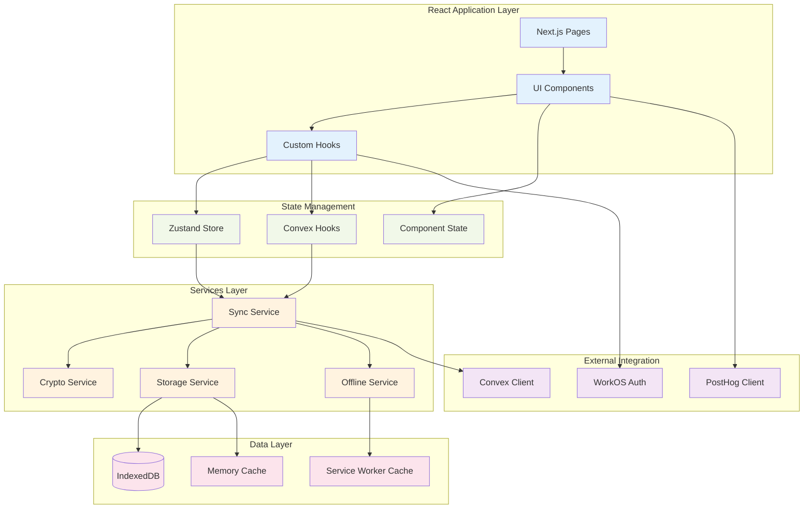
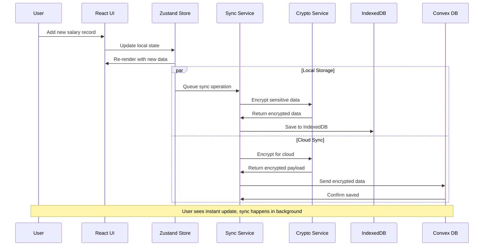

# Total Compensation Calculator - Architecture Documentation

**Version:** 1.0  
**Date:** July 2025  
**Audience:** Junior Software Engineers

---

## Table of Contents

1. [Overview](#overview)
2. [High-Level Architecture](#high-level-architecture)
3. [Client-Side Architecture](#client-side-architecture)
4. [Data Flow & Sync](#data-flow--sync)
5. [Security Architecture](#security-architecture)
6. [Deployment Architecture](#deployment-architecture)
7. [Technology Stack Deep Dive](#technology-stack-deep-dive)
8. [Key Concepts for Junior Engineers](#key-concepts-for-junior-engineers)

---

## Overview

The Total Compensation Calculator is a **local-first, privacy-focused web application** that helps users track their complete compensation packages (salary, bonuses, equity). The architecture prioritizes:

- **Privacy**: All sensitive data is encrypted client-side
- **Performance**: Local operations respond in <50ms
- **Offline Support**: Works without internet connection
- **Real-time Sync**: Changes sync across devices automatically

### What makes this architecture special?

1. **Zero-Knowledge**: The server never sees your unencrypted data
2. **Local-First**: Your data lives on your device first, server second
3. **Progressive Web App (PWA)**: Installs like a native app
4. **Edge Computing**: Fast global response times

---

## High-Level Architecture


### How it works (Simple Explanation):

1. **Your Browser** is where you interact with the app
2. **IndexedDB** stores your data locally (like a mini-database on your device)
3. **Service Worker** handles offline functionality and background sync
4. **WASM** provides fast, secure encryption
5. **Edge Functions** are servers close to you for fast responses
6. **Convex** is the main database in the cloud
7. **WorkOS** handles secure login
8. **PostHog** tracks app usage (anonymously)

---

## Client-Side Architecture



### Layer Explanations:

#### 1. **React Application Layer**
- **Next.js Pages**: The different screens (Dashboard, Settings, etc.)
- **UI Components**: Reusable pieces (buttons, forms, charts)
- **Custom Hooks**: Reusable logic for components

#### 2. **State Management**
- **Zustand Store**: Manages app-wide state (like current user, settings)
- **Convex Hooks**: Connect to real-time database
- **Component State**: Local state for individual components

#### 3. **Services Layer**
- **Sync Service**: Handles syncing data between local and cloud
- **Crypto Service**: Encrypts/decrypts sensitive data
- **Storage Service**: Manages local data storage
- **Offline Service**: Handles offline functionality

#### 4. **Data Layer**
- **IndexedDB**: Browser database for local storage
- **Memory Cache**: Fast temporary storage
- **Service Worker Cache**: Caches app files for offline use

---

## Data Flow & Sync



### Sync Process Explained:

1. **User Action**: User adds/edits compensation data
2. **Immediate UI Update**: App shows changes instantly (optimistic update)
3. **Local Storage**: Data saved to IndexedDB immediately
4. **Background Sync**: Data encrypted and sent to cloud
5. **Conflict Resolution**: If conflicts occur, last-write-wins

### Why this approach?

- **Fast Response**: Users see changes immediately
- **Reliable**: Data saved locally first, so nothing is lost
- **Offline Support**: Works even without internet
- **Multi-device**: Changes sync across all your devices

---

## Security Architecture


### Security Layers Explained:

#### 1. **Client-Side Encryption (Zero-Knowledge)**
```typescript
// Simplified example of how encryption works
const password = "user-password";
const salt = generateSalt();

// Derive encryption key from password using Argon2
const key = await argon2.derive(password, salt);

// Encrypt sensitive data
const encryptedData = await aes256gcm.encrypt(sensitiveData, key);

// Only encrypted data is sent to server
sendToServer(encryptedData); // Server can't decrypt this!
```

#### 2. **Transport Security**
- **TLS 1.3**: All data encrypted in transit
- **Content Security Policy**: Prevents XSS attacks
- **CORS**: Controls which domains can access our API

#### 3. **Authentication**
- **WorkOS SSO**: Enterprise-grade login (Google, Microsoft, etc.)
- **JWT Tokens**: Secure session tokens
- **Session Management**: Automatic timeout for security

#### 4. **Server-Side Security**
- **Rate Limiting**: Prevents abuse (100 requests/minute per user)
- **Audit Logging**: Tracks all access for compliance
- **Zero-Knowledge Storage**: Server never sees unencrypted data

---

## Deployment Architecture


### Deployment Process:

1. **Developer pushes code** to GitHub
2. **GitHub Actions** automatically run tests and build
3. **Vercel** deploys to global edge network
4. **Edge Functions** serve API requests close to users
5. **CDN** serves static files (HTML, CSS, JS) globally
6. **External Services** provide specialized functionality

### Why Edge Deployment?

- **Fast Loading**: Files served from nearest location
- **Low Latency**: API responses in ~50-100ms globally
- **Scalability**: Automatically handles traffic spikes
- **Reliability**: Multiple servers ensure uptime

---

## Technology Stack Deep Dive

### Frontend Technologies

#### **Next.js 15 (React Framework)**
```typescript
// Example: App Router structure
app/
├── layout.tsx          // Root layout
├── page.tsx           // Home page
├── dashboard/
│   ├── page.tsx       // Dashboard page
│   └── loading.tsx    // Loading component
└── api/
    └── sync/
        └── route.ts   // API endpoint
```

**Why Next.js?**
- **Server-Side Rendering**: Fast initial page loads
- **App Router**: Modern routing with layouts
- **API Routes**: Backend functionality in same codebase
- **Automatic Optimization**: Images, fonts, bundles optimized automatically

#### **Tailwind CSS + Radix UI**
```typescript
// Example: Styled button component
<Button className="bg-blue-500 hover:bg-blue-600 px-4 py-2 rounded-lg">
  Save Compensation
</Button>
```

**Why this combination?**
- **Tailwind**: Utility-first CSS, fast development
- **Radix UI**: Accessible, unstyled components
- **Consistent Design**: Predefined spacing, colors, typography

#### **Zustand (State Management)**
```typescript
// Example: Simple state store
const useCompensationStore = create((set) => ({
  records: [],
  addRecord: (record) => set((state) => ({ 
    records: [...state.records, record] 
  })),
  isLoading: false,
  setLoading: (loading) => set({ isLoading: loading })
}));
```

**Why Zustand over Redux?**
- **Simpler**: Less boilerplate code
- **TypeScript-first**: Great type safety
- **Small bundle**: Only 2.9kb gzipped
- **No providers**: Direct store access

### Backend Technologies

#### **Convex (Real-time Database)**
```typescript
// Example: Database mutation
export const addCompensation = mutation({
  args: {
    userId: v.string(),
    type: v.union(v.literal('salary'), v.literal('bonus')),
    encryptedData: v.object({
      data: v.string(),
      iv: v.string(),
      salt: v.string()
    })
  },
  handler: async (ctx, args) => {
    return await ctx.db.insert('compensationRecords', {
      ...args,
      createdAt: Date.now()
    });
  }
});
```

**Why Convex?**
- **Real-time**: Changes appear instantly across devices
- **TypeScript**: End-to-end type safety
- **Offline Support**: Built-in sync conflict resolution
- **ACID Transactions**: Data consistency guaranteed

#### **WorkOS (Authentication)**
```typescript
// Example: SSO login
const handleLogin = async () => {
  const authUrl = workos.sso.getAuthorizationUrl({
    domain: 'company.com',
    redirectUri: 'https://app.example.com/callback'
  });
  window.location.href = authUrl;
};
```

**Why WorkOS?**
- **Enterprise SSO**: Google, Microsoft, Okta support
- **Audit Logging**: Compliance requirements
- **Admin Portal**: IT teams can manage access
- **Security**: Industry-standard protocols

### Security Technologies

#### **Argon2 WASM (Password Hashing)**
```typescript
// Example: Key derivation
const deriveKey = async (password: string, salt: Uint8Array) => {
  const argon2 = await loadArgon2();
  return argon2.hash({
    password: new TextEncoder().encode(password),
    salt: salt,
    timeCost: 3,        // iterations
    memoryCost: 65536,  // 64MB memory
    hashLength: 32,     // 256-bit key
    type: argon2.Type.Argon2id
  });
};
```

**Why Argon2?**
- **Security**: Winner of password hashing competition
- **Configurable**: Adjust time/memory costs
- **WASM Performance**: Faster than JavaScript implementation
- **Industry Standard**: Used by major security tools

#### **AES-256-GCM (Data Encryption)**
```typescript
// Example: Encrypt sensitive data
const encryptData = async (data: string, key: CryptoKey) => {
  const iv = crypto.getRandomValues(new Uint8Array(12));
  const encodedData = new TextEncoder().encode(data);
  
  const encryptedData = await crypto.subtle.encrypt(
    { name: 'AES-GCM', iv },
    key,
    encodedData
  );
  
  return {
    data: arrayBufferToBase64(encryptedData),
    iv: arrayBufferToBase64(iv)
  };
};
```

**Why AES-256-GCM?**
- **Security**: Military-grade encryption
- **Authentication**: Detects data tampering
- **Performance**: Hardware acceleration available
- **Standard**: Used by banks, governments

---

## Key Concepts for Junior Engineers

### 1. **Local-First Architecture**

**Traditional App (Server-First):**
```
User Action → Server → Database → Server → UI Update
(Slow: 200-500ms)
```

**Our App (Local-First):**
```
User Action → Local Storage → UI Update (Fast: <50ms)
              ↓
         Background Sync → Server
```

**Benefits:**
- **Instant response**: No waiting for server
- **Offline support**: Works without internet
- **Better UX**: No loading spinners for basic actions

### 2. **Zero-Knowledge Architecture**

**Traditional App:**
```
Client: "Save my salary: $100,000"
Server: "OK, I can see you make $100,000" ❌
```

**Our App:**
```
Client: "Save this encrypted blob: xK8#mN2..."
Server: "OK, I saved the blob (but can't read it)" ✅
```

**Benefits:**
- **Privacy**: Server never sees sensitive data
- **Security**: Even if server is hacked, data is safe
- **Compliance**: Easier to meet privacy regulations

### 3. **Progressive Web App (PWA)**

A PWA is a web app that feels like a native app:

- **Installable**: Add to home screen
- **Offline**: Works without internet
- **Fast**: Cached resources load instantly
- **Responsive**: Works on any device size

### 4. **Edge Computing**

Instead of one server in one location:

```
Traditional:
User (Tokyo) → Server (US) → Database (US) → User (Tokyo)
(Slow: 500ms+ round trip)

Edge Computing:
User (Tokyo) → Edge Server (Tokyo) → Database (US) → Edge Server (Tokyo) → User (Tokyo)
(Fast: ~100ms round trip)
```

### 5. **Real-time Sync**

When you change data on one device, it automatically appears on all your other devices:

```mermaid
graph LR
    Phone[📱 Phone] 
    Laptop[💻 Laptop]
    Tablet[📱 Tablet]
    
    Phone <--> Cloud[(☁️ Cloud)]
    Laptop <--> Cloud
    Tablet <--> Cloud
    
    Phone -.->|"Real-time sync"| Laptop
    Phone -.->|"Real-time sync"| Tablet
    Laptop -.->|"Real-time sync"| Tablet
```



### 6. **Optimistic Updates**

Instead of waiting for server confirmation:

**Pessimistic (Traditional):**
1. User clicks "Save"
2. Show loading spinner
3. Send to server
4. Wait for response
5. Update UI

**Optimistic (Our App):**
1. User clicks "Save"
2. Update UI immediately
3. Send to server in background
4. If error, revert and show error

### Common Development Patterns

#### **Custom Hooks Pattern**
```typescript
// Reusable logic for components
const useCompensationData = () => {
  const [data, setData] = useState([]);
  const [loading, setLoading] = useState(true);
  
  useEffect(() => {
    loadCompensationData().then(setData).finally(() => setLoading(false));
  }, []);
  
  return { data, loading };
};

// Use in component
const Dashboard = () => {
  const { data, loading } = useCompensationData();
  
  if (loading) return <LoadingSpinner />;
  return <CompensationChart data={data} />;
};
```

#### **Service Layer Pattern**
```typescript
// Separate business logic from UI
class SyncService {
  static async saveCompensation(data: CompensationData) {
    // 1. Encrypt data
    const encrypted = await CryptoService.encrypt(data);
    
    // 2. Save locally
    await StorageService.save(encrypted);
    
    // 3. Sync to cloud
    await this.syncToCloud(encrypted);
  }
}

// Use from component
const handleSave = async (data) => {
  await SyncService.saveCompensation(data);
};
```

#### **Error Boundary Pattern**
```typescript
// Catch and handle errors gracefully
const ErrorBoundary = ({ children }) => {
  const [hasError, setHasError] = useState(false);
  
  if (hasError) {
    return <ErrorFallback onRetry={() => setHasError(false)} />;
  }
  
  return children;
};
```

---

This architecture documentation provides a comprehensive overview of how the Total Compensation Calculator is built. The key takeaway is that we've prioritized user experience, privacy, and performance through careful architectural decisions like local-first data, zero-knowledge encryption, and edge computing.

For junior engineers, focus on understanding these core concepts:
1. **Component-based architecture** (React)
2. **Local-first data flow** (immediate UI updates)
3. **Service layers** (separation of concerns)
4. **Security by design** (encryption first)
5. **Progressive enhancement** (works offline)

Each of these patterns and technologies serves a specific purpose in creating a fast, secure, and reliable application.