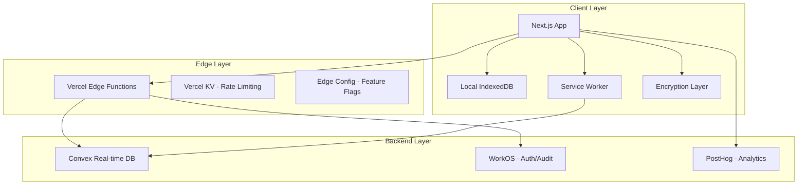

# Product Requirements Document

## Total Compensation Calculator Web Application

**Version:** 1.0  
**Date:** January 2025  
**Status:** Draft

---

## Table of Contents

1. [Executive Summary](#executive-summary)
2. [Project Overview](#project-overview)
3. [Goals & Objectives](#goals--objectives)
4. [User Requirements](#user-requirements)
5. [Functional Requirements](#functional-requirements)
6. [Technical Architecture](#technical-architecture)
7. [Security Requirements](#security-requirements)
8. [Performance Requirements](#performance-requirements)
9. [Technology Stack](#technology-stack)
10. [Implementation Plan](#implementation-plan)
11. [Success Metrics](#success-metrics)
12. [Risks & Mitigations](#risks--mitigations)

---

## Executive Summary

The Total Compensation Calculator is a secure, cross-device web application designed to help users track and visualize their complete compensation packages including salary, bonuses, and equity grants. The application prioritizes user privacy with client-side encryption, fast performance through local-first architecture, and seamless cross-device synchronization.

### Key Differentiators

- **Zero-Knowledge Architecture**: User data is encrypted client-side; backend never sees plaintext
- **Local-First Performance**: Sub-50ms response times with offline functionality
- **Enterprise Security**: WorkOS integration for SSO and compliance
- **Minimal Backend Calls**: Efficient sync protocol reduces API calls by 90%

---

## Project Overview

### Problem Statement

Professionals lack a secure, comprehensive tool to track their total compensation across multiple jobs, including complex equity vesting schedules and various bonus structures. Existing solutions either lack privacy, require constant internet connectivity, or don't handle the complexity of modern compensation packages.

### Solution

A privacy-first web application that:

- Encrypts all financial data client-side
- Works offline with automatic sync
- Handles complex equity vesting calculations
- Provides powerful analytics and visualizations
- Maintains audit trails for compliance

### Target Users

1. **Primary**: Tech professionals with complex compensation (salary + equity + bonuses)
2. **Secondary**: Finance professionals tracking multiple income streams
3. **Tertiary**: HR teams needing secure compensation tracking tools

---

## Goals & Objectives

### Business Goals

1. Launch MVP within 90 days
2. Achieve <2s load time on 3G networks
3. Support 10,000 concurrent users on minimal infrastructure
4. Maintain <$10/month infrastructure cost per 1,000 users

### User Goals

1. Track complete compensation history securely
2. Understand vesting schedules and upcoming payments
3. Analyze compensation trends over time
4. Access data from any device seamlessly

### Technical Goals

1. Implement zero-knowledge encryption
2. Achieve <100KB initial bundle size
3. Enable offline-first functionality
4. Minimize backend API calls through intelligent sync

---

## User Requirements

### User Stories

#### Compensation Tracking

- **As a user**, I want to add my salary information including company, title, and location so I can track my career progression
- **As a user**, I want to record various types of bonuses (performance, signing, spot) so I can see my total compensation
- **As a user**, I want to input equity grants with vesting schedules so I can track my ownership over time
- **As a user**, I want to update Fair Market Values (FMV) for my equity so I can see current portfolio value

#### Analytics & Insights

- **As a user**, I want to see my year-to-date earnings so I can track progress against goals
- **As a user**, I want to visualize compensation trends over time so I can see career growth
- **As a user**, I want to understand my upcoming vesting events so I can plan financially
- **As a user**, I want to compare compensation across different companies I've worked for

#### Security & Privacy

- **As a user**, I want my data encrypted so only I can access it
- **As a user**, I want to use SSO from my company so I don't manage another password
- **As a user**, I want audit logs of all access so I can ensure security
- **As a user**, I want automatic session timeout so my data is protected on shared devices

#### Data Management

- **As a user**, I want to export my data to CSV/JSON so I have backups
- **As a user**, I want to bulk edit/delete records so I can manage data efficiently
- **As a user**, I want to work offline and sync later so I'm not dependent on connectivity

---

## Functional Requirements

### Core Features

#### 1. Authentication & Authorization

- WorkOS SSO integration (Google, Microsoft, Okta)
- Session management with 15-minute idle timeout
- Device fingerprinting for trusted devices
- Biometric authentication support on mobile

#### 2. Compensation Management

##### Salary Tracking

- **Fields**: Base salary, currency, frequency, company, title, location, start/end dates
- **Operations**: Create, read, update, delete, bulk operations
- **Validation**: Date overlap prevention, currency validation
- **History**: Complete audit trail of changes

##### Bonus Management

- **Types**: Performance, signing, retention, spot, referral, profit-sharing, other
- **Fields**: Amount, date, type, description, payroll date
- **Features**: Recurring bonus support, bulk operations
- **Analytics**: YTD calculations, bonus trends

##### Equity & Vesting

- **Grant Types**: ISO, NSO, RSU, ESPP, warrants
- **Vesting Schedules**: Immediate, cliff, monthly, quarterly, annual, custom
- **Calculations**: Automatic vest event generation, FMV tracking
- **Exercise Tracking**: Exercise events, tax implications

#### 3. Analytics Dashboard

##### Overview Cards

- Total Compensation (YTD)
- Salary (Current)
- Bonuses (YTD)
- Vested Equity Value
- Upcoming Vests (30 days)

##### Visualizations

- Compensation timeline (line chart)
- Compensation breakdown (pie chart)
- Vesting schedule (gantt chart)
- Company comparison (bar chart)
- Growth rate analysis (area chart)

##### Filtering & Grouping

- Date range selection
- Group by company/year/type
- Currency conversion
- Export to image/PDF

#### 4. Data Operations

##### Import/Export

- CSV export with column selection
- JSON export for complete backup
- Future: CSV import with mapping

##### Automation

- Daily vesting calculations (9 AM UTC)
- Upcoming vest notifications
- Automatic FMV updates
- Scheduled report generation

---

## Technical Architecture

### System Architecture



### Data Flow

#### 1. Local-First Operations

```typescript
User Action → Local IndexedDB → Optimistic UI Update → Background Sync → Convex
```

#### 2. Sync Protocol

```typescript
// Efficient batch synchronization
1. Aggregate local changes
2. Compress and encrypt batch
3. Single API call to sync endpoint
4. Receive and apply remote changes
5. Resolve conflicts (last-write-wins)
```

#### 3. Encryption Flow

```typescript
// Client-side only encryption
1. Derive key from user password + salt (Argon2)
2. Encrypt data with AES-256-GCM
3. Store encrypted blob in Convex
4. Backend never sees plaintext
```

---

## Security Requirements

### Encryption Standards

- **Algorithm**: AES-256-GCM for data encryption
- **Key Derivation**: Argon2id with minimum 3 iterations, 64MB memory
- **Key Storage**: In-memory only, derived per session
- **Transport**: TLS 1.3 minimum

### Authentication & Authorization

- **SSO Provider**: WorkOS (supports Google, Microsoft, Okta, etc.)
- **Session Management**: 15-minute idle timeout, 24-hour absolute timeout
- **MFA**: Required for enterprise users
- **Device Trust**: Optional trusted device registration

### Audit & Compliance

- **Audit Logging**: Every data access/modification logged via WorkOS
- **Data Residency**: User chooses data location (US/EU)
- **Right to Delete**: Complete data purge within 30 days
- **Export**: Users can export all data at any time

### Security Controls

- **Rate Limiting**: 100 requests/minute per user via Vercel KV
- **Input Validation**: Zod schemas for all inputs
- **XSS Prevention**: React's built-in protections + CSP headers
- **SQL Injection**: Not applicable (NoSQL with parameterized queries)

---

## Performance Requirements

### Load Time Targets

- **Initial Load**: <2s on 3G, <500ms on 4G
- **Time to Interactive**: <3s on 3G, <1s on 4G
- **Core Bundle Size**: <100KB gzipped
- **Total Bundle Size**: <300KB gzipped

### Runtime Performance

- **Local Operations**: <50ms response time
- **Sync Operations**: <500ms for typical batch
- **Search/Filter**: <100ms for 10,000 records
- **Chart Rendering**: <200ms for complex visualizations

### Scalability Targets

- **Concurrent Users**: 10,000 active users
- **Data Volume**: 1M records per user
- **Sync Frequency**: 3 syncs/day average
- **Storage**: 50MB local, unlimited cloud

### Optimization Strategies

1. Route-based code splitting
2. Virtual scrolling for large lists
3. Web Workers for calculations
4. WASM for encryption operations
5. Progressive enhancement

---

## Technology Stack

### Frontend Stack

```json
{
  "framework": "Next.js 14 (App Router)",
  "ui": "Tailwind CSS + Radix UI",
  "state": "Zustand + Convex hooks",
  "forms": "React Hook Form + Zod",
  "charts": "Recharts (lazy loaded)",
  "crypto": "Web Crypto API + Argon2 WASM"
}
```

### Backend Stack

```json
{
  "database": "Convex (real-time, ACID compliant)",
  "auth": "WorkOS (SSO + audit logs)",
  "hosting": "Vercel (Edge Functions)",
  "cache": "Vercel KV (Redis)",
  "config": "Vercel Edge Config",
  "analytics": "PostHog (privacy-first)"
}
```

### Development Tools

```json
{
  "language": "TypeScript (strict mode)",
  "testing": "Vitest + Playwright",
  "linting": "ESLint + Prettier",
  "ci/cd": "GitHub Actions",
  "monitoring": "Sentry + Vercel Analytics"
}
```

### Third-Party Services

#### Convex

- Real-time database with offline support
- Automatic conflict resolution
- Built-in authentication hooks
- Scheduled functions for automation

#### WorkOS

- Enterprise SSO (SAML, OIDC)
- Audit log API
- Directory sync
- Admin portal

#### PostHog

- Privacy-first analytics
- Feature flags
- Session recordings (opt-in)
- Custom events

#### Vercel

- Edge network deployment
- Serverless functions
- KV store for rate limiting
- Edge Config for feature flags

---

## Implementation Plan

### Phase 1: Foundation (Weeks 1-2)

- [ ] Project setup (Next.js, Convex, WorkOS)
- [ ] Authentication flow with WorkOS
- [ ] Basic database schema in Convex
- [ ] Client-side encryption implementation
- [ ] Local storage layer with IndexedDB

### Phase 2: Core Features (Weeks 3-4)

- [ ] Salary management CRUD
- [ ] Bonus tracking functionality
- [ ] Basic equity grant support
- [ ] Simple dashboard with cards
- [ ] Data export (CSV/JSON)

### Phase 3: Advanced Features (Weeks 5-6)

- [ ] Complex vesting calculations
- [ ] Advanced analytics charts
- [ ] Bulk operations
- [ ] Offline sync implementation
- [ ] Audit logging integration

### Phase 4: Optimization (Weeks 7-8)

- [ ] Performance optimization
- [ ] Security hardening
- [ ] Rate limiting
- [ ] Error handling and recovery
- [ ] Progressive enhancement

### Phase 5: Polish & Launch (Weeks 9-12)

- [ ] UI/UX refinements
- [ ] Comprehensive testing
- [ ] Documentation
- [ ] Beta testing program
- [ ] Production deployment

---

## Success Metrics

### Technical Metrics

- **Performance Score**: >90 Lighthouse score
- **Uptime**: 99.9% availability
- **Error Rate**: <0.1% of requests
- **Sync Success**: >99.5% successful syncs

### User Metrics

- **Activation Rate**: 80% complete profile within 7 days
- **Retention**: 70% monthly active users
- **Engagement**: 3+ sessions per week average
- **Sync Frequency**: 2+ devices per active user

### Business Metrics

- **Infrastructure Cost**: <$10/month per 1,000 users
- **Support Tickets**: <5% of users need support
- **User Growth**: 20% month-over-month
- **Feature Adoption**: 60% use advanced features

---

## Risks & Mitigations

### Technical Risks

| Risk | Impact | Likelihood | Mitigation |
|------|--------|------------|------------|
| Encryption key loss | High | Medium | Key recovery via WorkOS + security questions |
| Sync conflicts | Medium | High | Last-write-wins + conflict UI |
| Convex downtime | High | Low | Offline mode + queued sync |
| Data corruption | High | Low | Checksums + backup recovery |

### Security Risks

| Risk | Impact | Likelihood | Mitigation |
|------|--------|------------|------------|
| Data breach | Critical | Low | Zero-knowledge architecture |
| Account takeover | High | Medium | MFA + device trust |
| Session hijacking | Medium | Low | Short timeouts + fingerprinting |
| XSS attacks | Medium | Low | CSP + input sanitization |

### Business Risks

| Risk | Impact | Likelihood | Mitigation |
|------|--------|------------|------------|
| Slow adoption | High | Medium | Freemium model + referral program |
| Competitor features | Medium | High | Rapid iteration + user feedback |
| Compliance issues | High | Low | WorkOS compliance tools |
| Scaling costs | Medium | Medium | Efficient architecture + monitoring |

---

## Appendices

### A. Database Schema

See [Technical Architecture](#technical-architecture) section for detailed Convex schema

### B. API Documentation

To be generated from TypeScript types using TypeDoc

### C. Security Audit Checklist

- [ ] OWASP Top 10 review
- [ ] Penetration testing
- [ ] Encryption audit
- [ ] Access control review

### D. Performance Testing Plan

- [ ] Load testing with k6
- [ ] Lighthouse CI integration
- [ ] Real user monitoring setup
- [ ] Synthetic monitoring

---

**Document Version History**

- v1.0 - Initial draft (January 2025)
